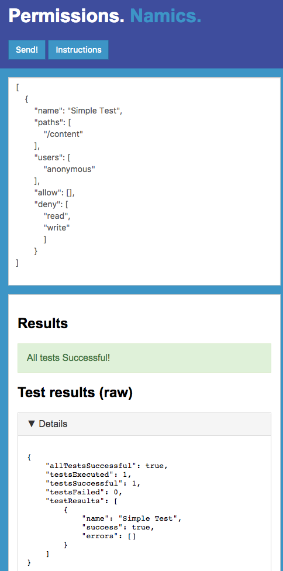

# AEM Permission Checker
This is a project provides a tool to test user permissions for [Adobe Experience Manager 6.3](https://helpx.adobe.com/experience-manager/6-3/release-notes.html).

## How to use

### Requirements
* AEM 6.3 or later

### Download
> comming soon

### Installation and Configuration
Upload and install the content package using the [CRX Package Manager](http://localhost:4502/crx/packmgr/index.jsp).

The permission checker servlet is disabled by default (for security reasons). It can be enabled in the [OSGi Configuration](http://localhost:4502/system/console/configMgr) ("Namics Permission Checker Servlet").
Of course you are free to create a runmode specific configuration in your code to enable or disable for different environments.

**WARNING!** The permission checker is meant to be a tool to support you during development. It's highly recommended **NOT** to use it in production! But hey, I'm just a README file. I cannot tell you how to live your live.

By default only the user `admin` has the permissions call the servlet. If you want to grant access for other users you need to add them to the group `namics-permission-checker` which was automatically created during package installation.


### Check permissions

To perform a permission check you can send your test definition as a POST request to the permission checker servlet:

A test definition has the following schema:
```json
[
  {
    "name": "*testname*",
    "paths": [
      "*pathToNode*",
      "*pathToNode*"
    ],
    "users": [
      "*userId*",
      "*userId*"
    ],
    "allow": [
      "*permission*",
      "*permission*"
    ],
    "deny": [
      "*permission*",
      "*permission*"
    ]
  },
  ...
]
```

|Property|Description|Allowed values|Example|
|--- |--- |--- |--- |
|name|Name of the test case|Arbitrary String|"Test anonymous permissions", "Test1", etc.|
|paths|Array of paths (Nodes)|Valid jcr paths|"/apps", "/content/myWeb/en/home/myPage", etc|
|users|Array of user IDs|Valid user IDs|"anonymous", "my-demo-author", etc.|
|allow, deny|Array of jcr permissions | read, write, modifyProperties, addChildNodes, removeNode, removeChildNodes, readAccessControl, modifyAccessControl, lockManagement, versionManagement, nodeTypeManagement, retentionManagement, lifecycleManagement, all, replicate | "read", "replicate", etc. |

#### Using curl
```shell
curl -u <username>:<password> http://<host>:<port>/bin/permissionchecker -d @<path/to/json/file> --header "Content-Type: application/json" -k
```
*Small side note: The curl user agent is white-listed in the "Adobe Granite CSRF Filter" configuration by default. This allows the request to bypass the CSRF check. If you have troubles with the curl request, please check this configuration.*

Example response:
```json
{
    "allTestsSuccessful": false,
    "testsExecuted": 2,
    "testsSuccessful": 1,
    "testsFailed": 1,
    "testResults": [
        {
            "name": "Test for my-authors",
            "success": true,
            "errors": []
        },
        {
            "name": "Test for anonymous",
            "success": false,
            "errors": [
                "Failed! User: anonymous, Path: /content, Action: read, Expected: false, But was: true"
            ]
        }
    ]
}
```

#### Using the GUI
The permission checker provides a simple GUI which allows you to execute tests and display its result. It can be found in the aem tool section:
 


Direct link:[/apps/namics/permissionchecker/gui.html](http://localhost:4502/apps/namics/permissionchecker/gui.html)


## How to contribute

### Requirements
* Java 8 or later
* Maven 3.3.9 or later

### Modules
The main parts of the projects are:

* core: Java bundle containing all core functionality like OSGi services as well as component-related Java code such as servlets.
* ui.apps: contains the /apps parts of the project such as the permission checker gui and the "tools" menu entry for the AEM backend.

### How to build locally
To build all the modules run in the project root directory the following command with Maven 3:

    mvn clean install

If you have a running AEM instance you can build and package the whole project and deploy into AEM with  

    mvn clean install -PautoInstallPackage
    
Or to deploy it to a publish instance, run

    mvn clean install -PautoInstallPackagePublish
    
Or alternatively

    mvn clean install -PautoInstallPackage -Daem.port=4503

Or to deploy only the bundle to the author, run

    mvn clean install -PautoInstallBundle


### Maven settings
The project comes with the auto-public repository configured. To setup the repository in your Maven settings, refer to:

[http://helpx.adobe.com/experience-manager/kb/SetUpTheAdobeMavenRepository.html](http://helpx.adobe.com/experience-manager/kb/SetUpTheAdobeMavenRepository.html)
